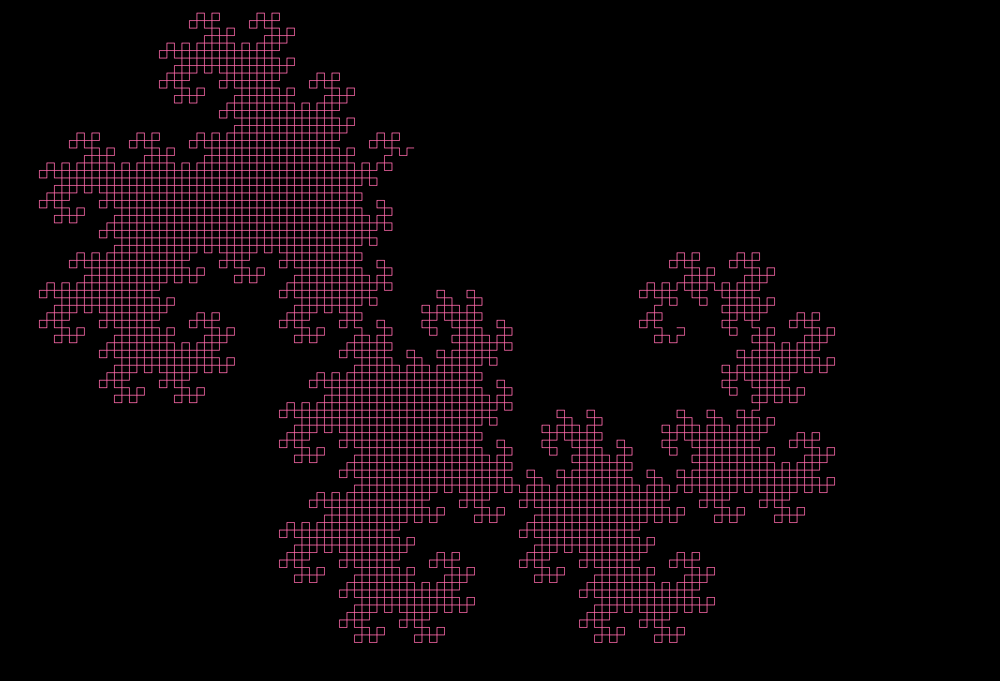
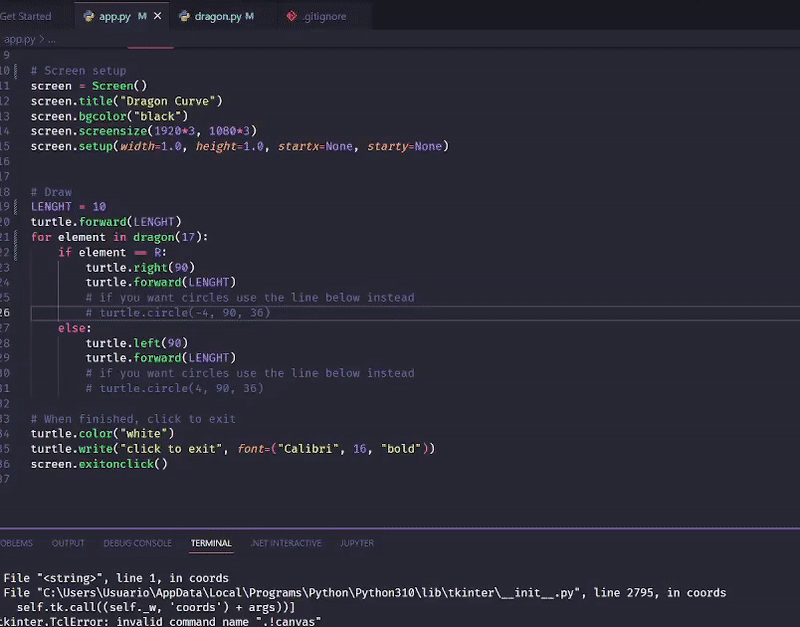
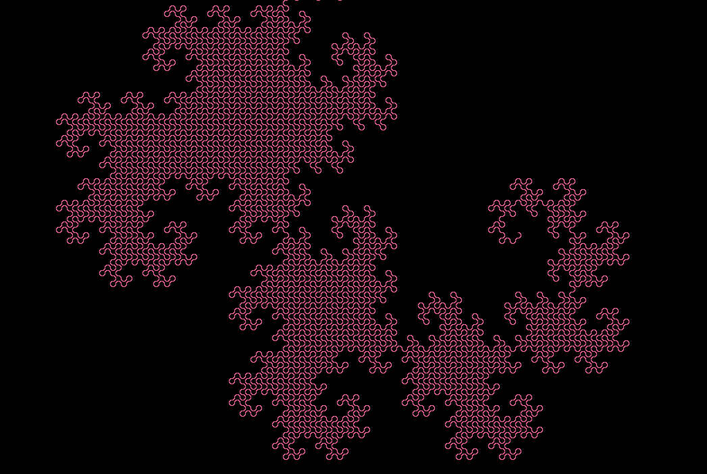

# Dragon Curve 🐉
Dragon curve fractal made with Python.



<div align="center">

  
  
</div>

- [Dragon Curve 🐉](#dragon-curve-)
  - [What is the Dragon Curve ?](#what-is-the-dragon-curve-)
  - [Run the application](#run-the-application)
  - [Want to know more?](#want-to-know-more)
  - [License](#license)

## What is the Dragon Curve ?
Foremost, the Dragon Curve is a fractal, in mathematics, fractal is a term used to describe geometric shapes containing detailed structure at arbitrarily small scales. Many fractals appear similar at various scales.

The dragon curve is probably most commonly thought of as the shape that is generated from repeatedly folding a strip of paper in half, although there are other curves that are called dragon curves that are generated differently.

## Run the application


1. Clone the repo
```bash
git clone https://github.com/francofgp/dragon-curve
cd dragon-curve/
```

2. Run the application
```bash
python app.py
```
3. Enjoy
   


## Want to know more?

This repository is part of [👉 the post that I wrote on my blog here](https://www.giulianopertile.com/blog/dragon-curve-in-python/)



## License

Closures is provided under the [MIT License](https://github.com/vhesener/Closures/blob/master/LICENSE).

```text
MIT License

Copyright (c) 2022 Pértile Franco Giuliano

Permission is hereby granted, free of charge, to any person obtaining a copy
of this software and associated documentation files (the "Software"), to deal
in the Software without restriction, including without limitation the rights
to use, copy, modify, merge, publish, distribute, sublicense, and/or sell
copies of the Software, and to permit persons to whom the Software is
furnished to do so, subject to the following conditions:

The above copyright notice and this permission notice shall be included in all
copies or substantial portions of the Software.

THE SOFTWARE IS PROVIDED "AS IS", WITHOUT WARRANTY OF ANY KIND, EXPRESS OR
IMPLIED, INCLUDING BUT NOT LIMITED TO THE WARRANTIES OF MERCHANTABILITY,
FITNESS FOR A PARTICULAR PURPOSE AND NONINFRINGEMENT. IN NO EVENT SHALL THE
AUTHORS OR COPYRIGHT HOLDERS BE LIABLE FOR ANY CLAIM, DAMAGES OR OTHER
LIABILITY, WHETHER IN AN ACTION OF CONTRACT, TORT OR OTHERWISE, ARISING FROM,
OUT OF OR IN CONNECTION WITH THE SOFTWARE OR THE USE OR OTHER DEALINGS IN THE
SOFTWARE.
```


[MIT](https://choosealicense.com/licenses/mit/)
